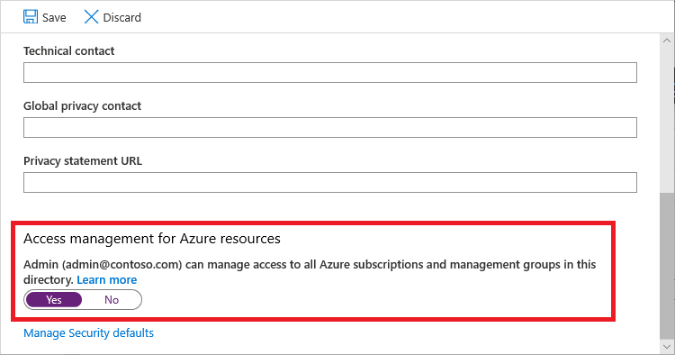

# Send envent User Access Administrator from Activity Log to Sentinel

This Logic App allows you to send to Sentinel the Activity Log event for User Access Administrator elevations. This event is not possible to enable diagnostics settings for it.

The Logic App have an automatic recurrence every hour to read the Azure Activity Log, looking for the event "Microsoft.Authorization/elevateAccess/action". You can change this at your convenience.

[UserAccessAdministratorAAD.json](UserAccessAdministratorAAD.json)

AAD elevations



## Permissions

It's convenient to configure a Service Principal in Azure AD to make calls to the Azure API REST. instead of a user. This Enterprise Application must have 'user_impersonation' permissions.
Also, You could use a Manage Identity.


You must assign Reader role permissions in the microsoft.Insights provider to the Service Principal Object ID (or Manage Identity if you prefer). The OBject ID of the Service Principal is used ( `_SERVICE_PRINCIPAL_OBJECT_ID_` ), instead name of the application.


```bash
az role assignment create --assignee "_SERVICE_PRINCIPAL_OBJECT_ID_" --role "Reader" --scope "/providers/Microsoft.Insights"
```

The RBAC role '**Log Analytics Contributor**' should added to your Sentinel resource.


## Custom Log Sentinel table

After run the Logic App, we sholud obtain a JSON file tu upload like a template of Custom Log on Sentinel.
I use this: '**DirectoryActivityLogs_CL**'


## Customise parameters

This following values should be customised in the Logic App json file, with your personal data about the Service Principal to make calls to the API and values of Sentinel subscription.

```
_LOG_ANALYTICS_WORKSPACE_SENTINEL_SUBSCRIPTION_ID_
_LOG_ANALYTICS_WORKSPACE_SENTINEL_RESOURCE_GROUP_NAME_
_LOG_ANALYTICS_WORKSPACE_SENTINEL_NAME_
_SERVICE_PRINCIPAL_TENANT_ID_
_SERVICE_PRINCIPAL_OBJECT_ID_
_SERVICE_PRINCIPAL_CLIENT_ID_
_SERVICE_PRINCIPAL_CLIENT_SECRET_ID_
```

Also, the Storage Account Resource ID, and particularly the resource location, should be checked:

`"/subscriptions/_LOG_ANALYTICS_WORKSPACE_SENTINEL_SUBSCRIPTION_ID_/providers/Microsoft.Web/locations/westeurope/managedApis/azureloganalyticsdatacollector"`


## Documentation

- [Steps and original idea from Adriaans Ramblings blog](https://adr.iaan.be/blog/adding-directory-activity-logs-to-microsoft-sentinel/)
- [az role assignment create](https://docs.microsoft.com/en-us/cli/azure/role/assignment?view=azure-cli-latest)

